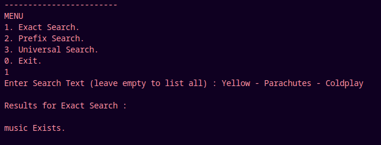
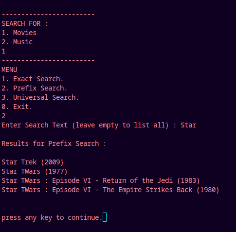
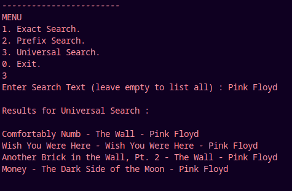

# Trie Based Search Engine
A Simple Search Engine implementation using Trie Data Structure.

# Trie
Trie is a type of k-ary search tree used for storing and searching a specific key from a set. Using Trie, search complexities can be brought to optimal limit (key length). 

A trie (derived from retrieval) is a multiway tree data structure used for storing strings over an alphabet. It is used to store a large amount of strings. The pattern matching can be done efficiently using tries.

The trie shows words like allot, alone, ant, and, are, bat, bad. The idea is that all strings sharing common prefix should come from a common node. The tries are used in spell checking programs.

- Preprocessing pattern improves the performance of pattern matching algorithm. But if a text is very large then it is better to preprocess text instead of pattern for efficient search.
- A trie is a data structure that supports pattern matching queries in time proportional to the pattern size.

# Time Complexities
> Insert : O(m)    : m is the length of string.  
> Delete : O(m)    : m is the length of string.  
> Search : O(m)    : m is the length of string.  
>
> Space Complexity : O(n*m)     :  n = number of string , m = avg length of strings

# Example
### Exact Search

### Prefix Search 

### Universal Search 

